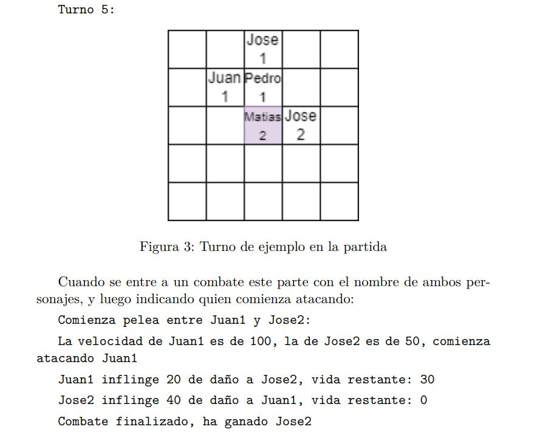

# **Tarea_3_PBN**

## **TODO`s:**
- ### **Juego:**
    - jugar( )
    - chequearGanador( )
    - calcularTurno( )
    - ~~combate( )~~

---

## **Clases:**

- **Posicion:** int x, int y
- **Personaje:** string name, int health, int attack, int speed, Posicion pos (*Posicion es la Clase de arriba*)
- **Mapa:** int ancho, int alto
- **Juego:** representa el juego

---

## **Métodos:**

- ### **Posicion**

    - **int getX():** Getter de coordenada X
    - **int getY():** Getter de coordenada Y
    - **void set(int x, int y):** Modifica las coordenadas (*Setter*)

- ### **Personaje**

    - **int attack():** retorna el daño que se hará al oponente
    - **void recibirAtaque(Personaje enemigo):** Recibe un ataque enemigo
    - **moverse():** mueve al personaje según mecanicas del juego

- ### **Mapa**

    - **crearMapa(int ancho, int alto):** crea un mapa de ancho x alto
    - **void agregarPersonaje(Personaje personaje):** agrega un personaje en el mapa
    - **void eliminarPersonaje(Personaje personaje):** elimina un personaje del mapa

- ### **Juego**

    - **void jugar():** inicia el juego
    - **void chequearGanador():** chequea si ha ganado alguno de los ejercitos
    - **int calcularTurno():** retorna el indice del personaje que debe jugar
    - **void mostrarMapa():** muestra en la consola el mapa del juego y con sus personajes
    - **void combate(Personaje p1, Personaje p2):** Simula una pelea entre dos personajes

---

## **Mecánica del Juego:**

- ### **Inicio:** Se rellenará el tablero con un archivo de texto [soldados.txt](soldados.txt) con el siguiente formato:

    - **Primera linea:** ancho y alto del tablero separados por coma.
    - **Segunda linea:** N° de personajes del ejercito 1.
    - **N lineas:** info de cada personaje del ejercito 1 (nombre, vida, ataque, velocidad, coordenada X, coordenada Y )
    - **Siguiente linea:** M° de personajes del ejercito 2.
    - **M lineas:** info de cada personaje del ejercito 2 (nombre, vida, ataque, velocidad, coordenada X, coordenada Y )

- ### **Movimiento:** Reglas de movimiento

    - El primer ejercito en moverse es el que promedie mayor velocidad. Si es igual para ambos equipos, parte el 1.
    - Parte siempre el primer personaje del [archivo](soldados.txt) y luego el primero del segundo ejercito, luego el segundo del primer ejercito y así.
    - Si un personaje muere, se elimina del mapa y se salta su turno.
    - **Como el tablero ancho x alto es de tamaño impar, siempre abrá una casilla CENTRAL y los soldados se moveran hacia alla con las siguientes reglas:**
        - Siempre se moveran a la casilla que más los acerque al centro, en caso de no estar en ningun eje con el centro, se mueven en diagonal, del contrario, en dirección recta al centro.
        - Si la casilla esta vacia, termina su turno y se mueve con exito.
        - Si en su camino se topan con un **enemigo** lucharan a muerte con el, si vence termina el turno con exito y se mueve.
        - Si la casilla la ocupa un **aliado** no podrá ocuparla y se movera de forma vertical, siempre y cuando no esté en el eje del centro y pueda claramente.
    
- ### **Combate:** Siempre entre dos personajes.

    - Ataca primero el personaje con mayor velocidad, si es igual, el mayor ataque y si siguen igual, la mayor vida.
    - Pierde quien tenga vida menor o igual a cero.
    - El daño es igual al ataque del personaje.

- ### **Visualización:** 
    Siempre se muestra el número del turno y el tablero con la posicion de cada personaje. En cada casilla se debe mostrar el nombre del soldado y su ejercito (1 o 2). Cada casilla tiene un largo de 2 lineas y cada linea consta de 5 caracteres (todos los nombres son de 5 caracteres o menos) El número del ejercito debe ir centrado (__ N __).

    **Ejemplo de un turno:**
    